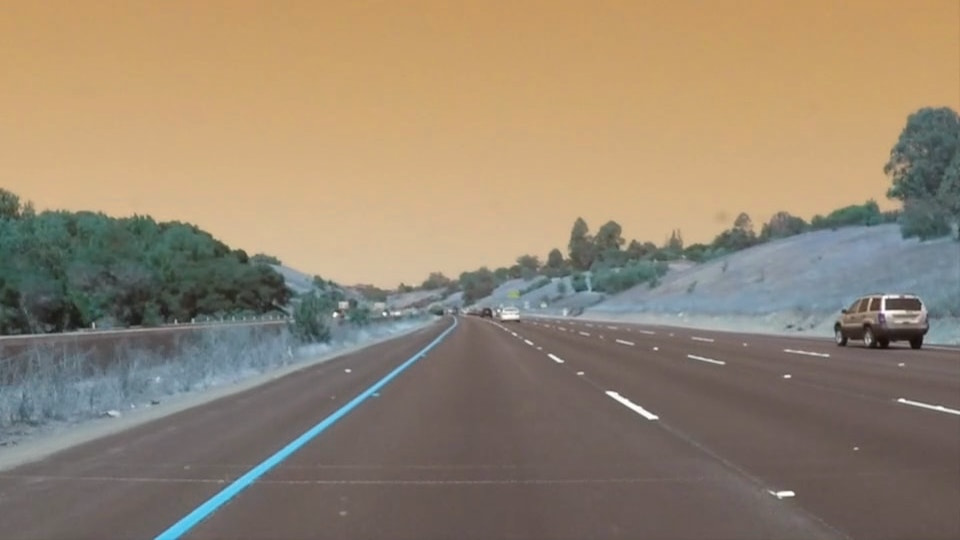
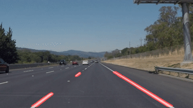

# Self-Driving Car Engineer Nanodegree

## Project: **Finding Lane Lines on the Road** 
***

## 1. Edge Feature Extraction

This method extracts the lane edges from a given image. The following steps used to do this:

1. Grayscale conversion
2. Apply CLAHE filter to improve contrast and refine edge boundaries
3. Gausian blur to reduce detail 
4. Added a sobel x filter to reduce horizontal noise
4. Call Canny edge detection
5. If not enough edges, dialate to make them continuous
6. If too many edges impose higher canny threshold

## 2. Color Feature Extraction
This is used to extract the lane edges based on the color information. The following steps are used to acheive this:

1. Convert BGR to HSV
2. Threshold the HSV image to get only yellow colors
3. Threshold the RBG image to get only white colors
4. Or the thresholded images to create a mask
5. Bitwise-AND mask and original image
6. Erode to reduce selected pixels

## 3. Region of Interest Mask
 Applies an image mask.
Only keeps the region of the image defined by the polygon
formed from `vertices`. The rest of the image is set to black.
1. vertice set 1, vertices set 1 for the birds eye view
2. defining a blank mask to start with
3. defining a 3 channel or 1 channel color to fill the mask with depending on the input image
4. filling pixels inside the polygon defined by vertices with the fill color    
5. returning the image only where mask pixels are nonzero

---
## 4. Feature Detection

The edge and color features extracted in the previous steps are used in this step. Lines present in the given image are detected through the probablistic Hough Transform. The detected line segments are classified as  part of left lane or right lane based on a set of heuristic conditions. 

for each set of classified line segments, a representative line is created using the average slope and X intercept. 

Finally, the weighted average method is used to create a first order filter and tom ensure that the detected lines dont move abrupbtuly from one frame to the other. 

---
## 5. Processing Pipeline

The pipeline method recieves the input image and provides annotated image with lane markers identified. This pipeline can be used to process images or frames from a video. The following steps are impemented in this method:
1. Recieve image
2. Edge and color based feature extraction
3. Line detection and lane marking
4. Transform the line markings from a birds eye view to perspective projection
5. Combine line markings to the recieved image 

**pipeline**(image,test_im = True,debug = False, raw_out = False):
 - image : Input image
 - test_im = True: For video input, set to False to apply moving average lane tracking
 - debug = False: Set to True to disply various stages of the pipeline 
 - raw_out = False: Set to True to display raw hough lines on the image
 - save = False: Set to true to save the pipeline steps

---
## 6. Test Methods
### 6. 1 Testing the given image set

**test_images**(test_images_path, save = False, plot = True):
 - test_image_path: Directory path containing the images
 - output_image_path: Directory path to save the output images
 - save: Boolean. True to save output images to the specified outptu directory
 - plot: Boolean. True to plot the results

### 6.2 Testing the given Video set

**test_videos**(video_file, output_video_path):
 - video_file: Video file path
 - output_video_path: Output path for the video
 
 Information regarding Codecs and video extension courtesy [pyimagesearch](http://www.pyimagesearch.com/2016/02/22/writing-to-video-with-opencv/)

## 7. Main

The main functions defines the directories for various inputs can calls the following functions:

1. test_pipeline : To demonstrate the various stages of the pipeline for a sample image

2. test_images : Demonstrate the pipeline on the test images

3. test_videos : Demonstrate the pipeline working on the following videos:
    - `challenge.mp4`
    - `solidWhiteRight.mp4`
    - `solidYellowLeft.mp4`

---

## 8. Output

Output at different states of the pipeline

    processing test_images/solidWhiteCurve.jpg... ok 0

    processing test_images/solidWhiteRight.jpg... ok 1

    processing test_images/solidYellowCurve.jpg... ok 2

    processing test_images/solidYellowCurve2.jpg... ok 3

    processing test_images/solidYellowLeft.jpg... ok 4

    processing test_images/whiteCarLaneSwitch.jpg... ok 5

    Processing... challenge   Done! output saved at:  output_videos/challenge_output.avi
    Processing... solidWhiteRight   Done! output saved at:  output_videos/solidWhiteRight_output.avi
    Processing... solidYellowLeft   Done! output saved at:  output_videos/solidYellowLeft_output.avi

## Summary and Reflection

[Git-Repository](https://github.com/aksagg88/Advanced-Lane-Detection.git)

This report demonstrates the implementation of a basic lane detection algorithm using a combination of the edge and color based feature extraction and Hough line detection. Though the concept of the algorithm was relatively simple, the actual was a lot harder than I my expectation. After implementing this lane detection pipeline, I have a greater appreciation of the challenges in deploying a vision based in real world setting.

The feature extraction method used in this algorithm leaves a lot more to be desired. Specially in driving situations with shadow cover and faded lanes the algorithm is unable to detect lanes. using a first order filter improves the performance a little bit but a better detection and tracking method is required.

Although the implemented algorithm was able to detect the straight line segments of the lane markings in the challenge video, in an real world implementation curved lanes need to be detected. A different approach with inverse perspective mapping and  spline fitting may solve this problem.
